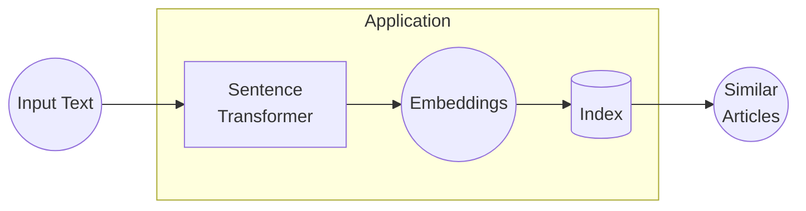

<!--markdownlint-disable MD033 MD041-->

<a id="readme-top"></a>

# ketchup: Citation, please?

<div align="center">
    <b><a href="TODO: Link here">🌐 Live Demo is available here! 🌐</a></b>
</div>
<br>

[![Contributors][contributors-shield]][contributors-url]
[![Forks][forks-shield]][forks-url]
[![Stargazers][stars-shield]][stars-url]
[![Issues][issues-shield]][issues-url]
[![License][license-shield]][license-url]

<details>
    <summary>Table of Contents</summary>
    <ol>
        <li><a href="#about">About</a></li>
        <li><a href="#getting-started-docker">Getting Started (Docker)</a></li>
        <li><a href="#getting-started-python">Getting Started (Python)</a></li>
        <li><a href="#contributing">Contributing</a></li>
        <li><a href="#license">License</a></li>
        <li><a href="#acknowledgements">Acknowledgements</a></li>
    </ol>
</details>

## About

<div align="center">
    <a href="https://commons.wikimedia.org/wiki/File:Family_eating_meal.jpg">
        
    </a>
</div>

Ever been cornered in a research discussion? You confidently cite a groundbreaking finding &ndash; 'As we know, sloths exhibit exceptional apnea capabilities exceeding those of dolphins...' &ndash; only to be met with the dreaded, academic equivalent of a dinner-table stare:

> 'Citation, please?'

They lean in, pens poised like tiny, judgmental scalpels.

You mumble, 'Uh... somewhere in the literature?' Cue the awkward silence, the raised eyebrows, the slow, sinking feeling of academic disgrace.

Fear no more! **ketchup** is your instant source-retrieval lifeline, your academic condiment of credibility. With **ketchup**, you'll have immediate access to the *precise* research papers backing those profound, yet vaguely recalled, findings.

This is a simple RAG implementation using SQLite-Vec and Sentence Transformer. The following graph explains the inference process:



With this, you can find research articles similar to the information (input text) you want to find.

There are two ways to get started:

* [Using Docker](#getting-started-docker) to run the web application;
* [Using Python](#getting-started-python).

<p align="right">[ <a href="#readme-top">back to top</a> ]</p>

## Getting Started (Docker)

### Prerequisites for Docker

* Docker

### Build the image

TODO

### Run the container

TODO

## Getting Started (Python)

### Prerequisites for Python

* Python 3.10+ with lastest version of pip.

### Installation

```bash
pip install git+https://github.com/hnthap/ketchup
```

### Prepare the Index

We have built an index of embeddings to use out of the box:

```python
from ketchup.data import download_data


# Your database file
db_name = 'ketchup.db'

download_data(db_name=db_name)
```

You can also build one yourself:

```python
from ketchup.data import initialize_data, insert_embeddings
from ketchup.embed import set_sentence_transformer_device


# Your database file
db_name = 'ketchup.db'

# The device to accelerate the sentence transformer
device = 'cuda'

# Initialize database.
# This does not need to be accelerated, so you can run it without GPU support.
initialize_data(db_name=db_name)

# Encode the abstracts and insert into database.
set_sentence_transformer_device(device)
insert_embeddings(db_name=db_name, batch_size=256)
```

### Usage

```python
from ketchup.paper import get_papers
from ketchup.search import search_knn


# Your database name
db_name = 'ketchup.db'

# Your query to search for papers
query = 'Vietnamese people afraid to lose "face".'

result = search_knn(query, k=5, db_name=db_name)
papers = get_papers(list(map(lambda x: x[0], result)), db_name=db_name)
```

<p align="right">[ <a href="#readme-top">back to top</a> ]</p>

## Contributing

If you have any suggestions, please fork this repository, make your edits and create a pull request. You can also open an issue with the tag "refill".

Don't forget to give a star if you find this helpful!

<p align="right">[ <a href="#readme-top">back to top</a> ]</p>

## License

Distributed under the MIT License. See [LICENSE](./LICENSE) for more information.

<p align="right">[ <a href="#readme-top">back to top</a> ]</p>

## Acknowledgements

These are some helpful resources that help us build this project:

* [asg017/sqlite-vec](https://github.com/asg017/sqlite-vec?tab=readme-ov-file) (GitHub)
* [sentence-transformers/all-mpnet-base-v2](https://huggingface.co/sentence-transformers/all-mpnet-base-v2) (HuggingFace)
* [Retrieval Augmented Generation in SQLite](https://towardsdatascience.com/retrieval-augmented-generation-in-sqlite/) by Ed Izaguirre (Towards Data Science)

<p align="right">[ <a href="#readme-top">back to top</a> ]</p>

[contributors-shield]: https://img.shields.io/github/contributors/hnthap/ketchup.svg?style=for-the-badge
[contributors-url]: https://github.com/hnthap/ketchup/graphs/contributors
[forks-shield]: https://img.shields.io/github/forks/hnthap/ketchup.svg?style=for-the-badge
[forks-url]: https://github.com/hnthap/ketchup/network/members
[stars-shield]: https://img.shields.io/github/stars/hnthap/ketchup.svg?style=for-the-badge
[stars-url]: https://github.com/hnthap/ketchup/stargazers
[issues-shield]: https://img.shields.io/github/issues/hnthap/ketchup.svg?style=for-the-badge
[issues-url]: https://github.com/hnthap/ketchup/issues
[license-shield]: https://img.shields.io/github/license/hnthap/ketchup.svg?style=for-the-badge
[license-url]: https://github.com/hnthap/ketchup/blob/master/LICENSE
