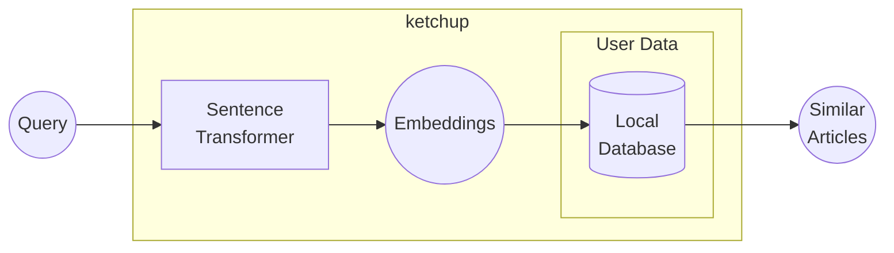

<!--markdownlint-disable MD033 MD041-->

<!--

TODO:
- write unit tests
- test for older versions of python
- make "ketchup The Web App"
- re-license this under apache 2.0
- explain the source of data, and how that affects.
- check all other TODOs in the source code
- explain that this project is in pre-release
- make live demo
- introduce the project's sister: ketchup the web app, and its demo
- git rebase to clean the messed up history

-->

<a id="readme-top"></a>

# ketchup: Citation, please?

<!-- <div align="center">
    <b><a href="">🌐 Live Demo is available here! 🌐</a></b>
</div>
<br> -->

[![Contributors][contributors-shield]][contributors-url]
[![Forks][forks-shield]][forks-url]
[![Stargazers][stars-shield]][stars-url]
[![Issues][issues-shield]][issues-url]
[![License][license-shield]][license-url]

<details>
    <summary>Table of Contents</summary>
    <ol>
        <li><a href="#about">About</a></li>
        <li><a href="#prerequisites">Prerequisites</a></li>
        <li><a href="#installation">Installation</a></li>
        <li><a href="#usage">Usage</a></li>
        <li><a href="#contributing">Contributing</a></li>
        <li><a href="#license">License</a></li>
        <li><a href="#acknowledgements">Acknowledgements</a></li>
    </ol>
</details>

<div align="center">
    <a href="https://commons.wikimedia.org/wiki/File:Family_eating_meal.jpg">
        
    </a>
</div>

Ever been cornered in a research discussion? You confidently cite a groundbreaking finding &ndash; 'As we know, sloths exhibit exceptional apnea capabilities exceeding those of dolphins...' &ndash; only to be met with the dreaded, academic equivalent of a dinner-table stare:

> 'Citation, please?'

They lean in, pens poised like tiny, judgmental scalpels.

You mumble, 'Uh... somewhere in the literature?' Cue the awkward silence, the raised eyebrows, the slow, sinking feeling of academic disgrace.

Fear no more! **ketchup** is your instant source-retrieval lifeline, your academic condiment of credibility. With **ketchup**, you'll have immediate access to the *precise* research papers backing those profound, yet vaguely recalled, findings.

## About

This application is an RAG implementation using [SQLite-Vec](https://github.com/asg017/sqlite-vec?tab=readme-ov-file) and [Sentence Transformer](https://huggingface.co/sentence-transformers/all-mpnet-base-v2). The following graph explains the inference process:



<p align="right">[ <a href="#readme-top">back to top</a> ]</p>

## Prerequisites

* Python 3.10+ with lastest version of pip.

<p align="right">[ <a href="#readme-top">back to top</a> ]</p>

## Installation

To install, run this:

```bash
pip install git+https://github.com/hnthap/ketchup
```

You are recommended to install this inside a virtual environment.

<p align="right">[ <a href="#readme-top">back to top</a> ]</p>

## Usage

With this, you can find research articles similar to the information (query) you want to find:

```python
from ketchup import get_papers, search_knn

# Your query
query = 'Vietnamese people usually afraid to lose "face".'

result = search_knn(query, k=5)
paper_ids = list(map(lambda x: x[0], result))
papers = get_papers(paper_ids)
```

<p align="right">[ <a href="#readme-top">back to top</a> ]</p>

## Contributing

If you have any suggestions, please fork this repository, make your edits and create a pull request. You can also open an issue.

Don't forget to give a star if you find this helpful!

<p align="right">[ <a href="#readme-top">back to top</a> ]</p>

## License

Distributed under the MIT License. See [LICENSE](./LICENSE) for more information.

<p align="right">[ <a href="#readme-top">back to top</a> ]</p>

## Acknowledgements

These are some helpful resources that help us build this project:

* [asg017/sqlite-vec](https://github.com/asg017/sqlite-vec?tab=readme-ov-file) (GitHub)
* [sentence-transformers/all-mpnet-base-v2](https://huggingface.co/sentence-transformers/all-mpnet-base-v2) (HuggingFace)
* [Retrieval Augmented Generation in SQLite](https://towardsdatascience.com/retrieval-augmented-generation-in-sqlite/) by Ed Izaguirre (Towards Data Science)

<p align="right">[ <a href="#readme-top">back to top</a> ]</p>

[contributors-shield]: https://img.shields.io/github/contributors/hnthap/ketchup.svg?style=for-the-badge
[contributors-url]: https://github.com/hnthap/ketchup/graphs/contributors
[forks-shield]: https://img.shields.io/github/forks/hnthap/ketchup.svg?style=for-the-badge
[forks-url]: https://github.com/hnthap/ketchup/network/members
[stars-shield]: https://img.shields.io/github/stars/hnthap/ketchup.svg?style=for-the-badge
[stars-url]: https://github.com/hnthap/ketchup/stargazers
[issues-shield]: https://img.shields.io/github/issues/hnthap/ketchup.svg?style=for-the-badge
[issues-url]: https://github.com/hnthap/ketchup/issues
[license-shield]: https://img.shields.io/github/license/hnthap/ketchup.svg?style=for-the-badge
[license-url]: https://github.com/hnthap/ketchup/blob/master/LICENSE
